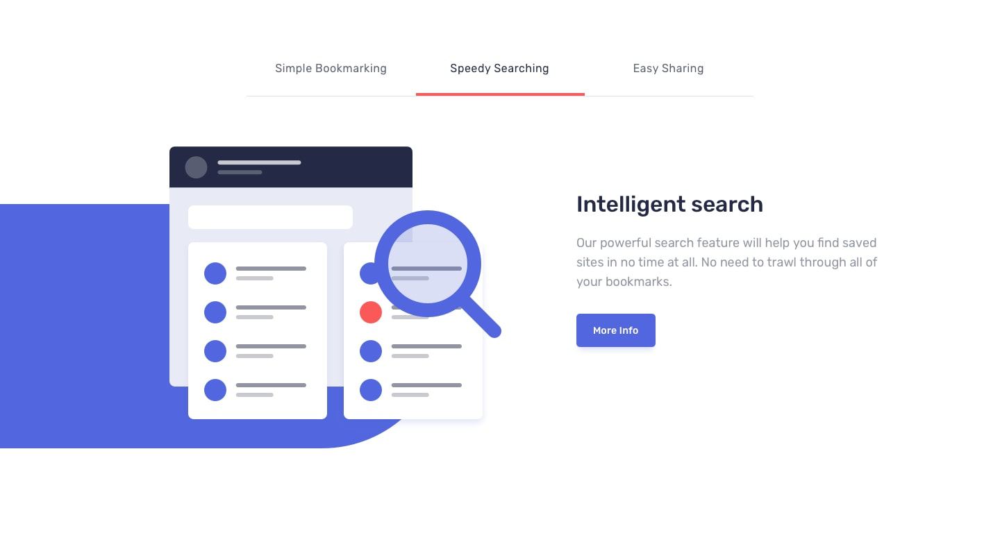

# Bookmark landing page

URL https://bookmark.alissanguyen.dev
A demo landing page for a bookmark tool.

### What to expect

> Users should be able to:
>
> - View the optimal layout for the site depending on their device's screen size
> - See hover states for all interactive elements on the page
> - Receive an error message when the newsletter form is submitted if:
> - The input field is empty
> - The email address is not formatted correctly

### Technologies

- ReactJS
- Webpack
- SCSS
- BEM methodology
- Mobile first
- Semantic HTML5 markup
- JavaScript
- Flexbox
- Intersection Observer API
